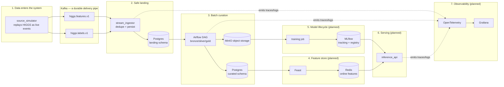

# Architecture

This document describes the target system design. It is written ahead of
full implementation (per the build order in `PROJECT_STATE.md`), so
sections describing unbuilt components are marked **(planned)**. Update a
section's status to built and link the relevant code/docs as each
milestone lands — don't let this drift into aspirational fiction.

## Start here (no prior ML/platform-engineering experience required)

**What AMEL actually does, in one paragraph.** A stream of physics
detector readings (the HIGGS dataset, replayed as if it were live) flows
continuously into the system. AMEL's job is to take that raw, messy,
continuously-arriving stream and turn it into: (1) a clean historical
record nothing loses or duplicates, (2) a trustworthy, validated dataset
other systems can build on, (3) a trained model that predicts something
useful from it, (4) an API that serves live predictions from that model,
and (5) enough visibility into all of the above that a human — or later,
a constrained AI agent — can tell what's happening and fix it when it
breaks. Every numbered layer below is one of those five things, built in
order, each one proven working before the next is added.

**Why build it this way instead of just training a model on a CSV?**
Because "train a model" is the easy 5% of real ML engineering. The other
95% — the part this project is actually about — is everything a model
needs *around* it to be useful and trustworthy in production: data has to
arrive reliably even when things crash mid-stream, be validated before
anyone trusts it, be reproducible enough that "what changed?" has an
answer, be servable with predictable latency, and be observable enough
that "why did this break?" has an answer too. AMEL builds each of those
properties as a real, working, verified system — not a slide describing
one.

**The system end to end, as it will look once every layer lands:**



Boxes 1–3 are built and verified today (Milestones 1–2). Boxes 4–7 are
planned — see the milestone-by-milestone build order below and
`PROJECT_STATE.md` for exactly what's real right now versus what's
still ahead.

**A short glossary, since the rest of this document uses these terms
constantly without re-explaining them:**

| Term | Plain-language meaning |
|---|---|
| **Idempotent** | Doing the same operation twice has the same effect as doing it once. The whole system leans on this constantly: if a message gets delivered twice (which distributed systems do, routinely), an idempotent write just quietly no-ops the second time instead of creating a duplicate. |
| **At-least-once delivery** | A messaging guarantee that a message will arrive one *or more* times, never zero times. Kafka gives you this by default. Combined with idempotent writes, "one or more times" becomes as safe as "exactly once" in practice. |
| **Watermark** | A saved "I've processed everything up to here" bookmark. Each pipeline run reads the watermark, processes everything newer than it, then moves the watermark forward — so a rerun never reprocesses old data from scratch. |
| **DAG** | "Directed Acyclic Graph" — Airflow's term for a pipeline: a set of steps with dependencies between them (step B can't start until step A finishes), and no step depends on itself, directly or in a loop. |
| **Bronze / silver / gold** | A common data-lake naming convention for "how refined is this data": bronze = raw copy exactly as it arrived, silver = cleaned and typed, gold = ready for a specific consumer (here, model training). |
| **Feature store** | A system that serves the same engineered features to both model training (historical, point-in-time-correct) and live inference (latest values, low latency) — so the model never sees different logic in the two places, a common and hard-to-debug source of production ML bugs. |
| **Point-in-time correctness** | When building a training example for "what happened at time T," only using data that was actually known *before* T — not accidentally leaking a future value into a historical training row. |
| **Idempotent sink** | The specific technique used here: an `event_id` as a database primary key plus `INSERT ... ON CONFLICT DO NOTHING`, so redelivering the same event a second time is a safe no-op instead of a duplicate row. |
| **Consumer group / offset** | Kafka concepts: a *consumer group* is one or more processes cooperatively reading a topic; an *offset* is "how far into the topic has this group read." Committing an offset means "don't send me this message again." |
| **Schema-valid but still wrong** | A message can pass structural validation (right fields, right types) while still being *semantically* wrong (a sensor value 1000x too large, a duplicate ID within a batch). AMEL validates for both, at different layers — see the "validate" pipeline stage. |

If a term shows up elsewhere in this document that isn't in that table,
`LEARNING_LOG.md` explains it in more depth in whichever milestone's
entry introduced it — that file is written explicitly to teach, not just
to record.

## Why this shape

AMEL simulates a realistic ML platform's operational surface: events
arrive continuously, must be validated and persisted exactly once, get
batch-processed into curated training data on a schedule, feed a feature
store that serves both training and low-latency inference, produce models
that are tracked and promoted deliberately (not silently), and the whole
thing is observable, deployable, scalable, and eventually operable by a
constrained agent system rather than only by a human. Each subsystem below
exists because a real ML platform needs it — not because it demonstrates a
buzzword.

## Layered build order **(architecture intent, tracked live in PROJECT_STATE.md)**

1. **Data plane**: source simulator → Kafka → stream consumer → Postgres
   (`landing` schema). At-least-once delivery + idempotent sink. See
   ADR references in `DECISIONS.md` as ingestion is built.
2. **Batch plane**: Airflow DAG promotes `landing` → `curated` via MinIO
   bronze/silver/gold Parquet, driven by watermarks, not full rescans.
3. **Feature plane**: Feast reads `curated`/Parquet offline, materializes
   to Redis online. Training reads offline (point-in-time correct);
   inference reads online (latest).
4. **Model plane**: reproducible training → MLflow tracking + registry,
   with explicit `candidate`→`champion` promotion criteria before
   `apps/inference_api` will serve a model.
5. **Serving plane**: `apps/inference_api` (predictions),
   `apps/platform_api` (control plane), `apps/webhook_service`
   (external event ingestion).
6. **Observability plane**: OpenTelemetry across all first-party
   services → Collector → Prometheus/Tempo/Loki/Grafana.
7. **Orchestration/scale plane**: Docker Compose → Kubernetes → HPA/KEDA.
8. **Automation plane**: normalized platform events + metadata graph →
   Agent Supervisor + specialized agents (read-only tools first) → RAG
   over runbooks → Temporal for durable, approvable remediation
   workflows → MCP as a thin read-only interface over the same
   service-layer functions the agents already call.
9. **Access plane**: Python SDK → CLI → minimal web app, all three
   against the same REST contracts.
10. **FinOps + serverless**: cost accounting as a cross-cutting concern
    once there's something (LLM calls, compute) to account for.

Each layer is built only after the one below it demonstrably works — see
`PROJECT_STATE.md`'s milestone list for the authoritative sequencing and
current status.

## Data flow, current (Milestone 2)

```
UCI HIGGS zip (downloaded once, streamed row-by-row, never fully
materialized) → source_simulator
    → higgs.features.v1 (immediate)     → stream_ingestor consumer group
    → higgs.labels.v1 (delayed by LABEL_DELAY_SECONDS)  ↗
         (deliberate duplicates + malformed payloads injected per
          DUPLICATE_RATE / INVALID_EVENT_RATE)

stream_ingestor: batch → validate (shared Pydantic schema) →
    valid    → landing.higgs_feature_events / landing.higgs_label_events
               (INSERT ... ON CONFLICT (event_id) DO NOTHING, one
               transaction per batch, Kafka offsets committed only after
               that transaction commits)
    invalid  → higgs.features.dlq / higgs.labels.dlq (envelope with
               reason + raw bytes; offset committed immediately — see
               LEARNING_LOG.md)

higgs_pipeline (Airflow DAG, higgs_pipeline_tasks.py has the logic):
  determine_high_watermark  (control.pipeline_watermarks: higgs_features / higgs_labels)
    → extract_new_records   (landing.* WHERE ingested_at in (watermark, upper_bound])
    → write_bronze          (MinIO bronze/higgs/{features,labels}/dt=.../run_id=....parquet — raw shape)
    → validate               (Pandera; invalid rows quarantined, report → MinIO pipeline/artifacts/...)
    → transform               (flatten nested `features` JSON → 28 typed float columns)
    → write_silver            (MinIO silver/... — analytics-ready shape)
    → update_curated_tables   (upsert curated.higgs_features/higgs_labels
                                + advance both watermarks — ONE transaction)
    → build_training_dataset  (join ACCUMULATED curated.higgs_features/higgs_labels
                                for entities missing from curated.training_records —
                                not this run's delta, so late-arriving labels are
                                still picked up; upsert + MinIO gold/training/....parquet)
    → update_feature_store    (stub — Feast lands in Milestone 3)
    → emit_pipeline_metadata  (one control.pipeline_runs row per run;
                                on_failure_callback covers the failure path too)
```

Implemented in `libs/amel_common` (shared schemas/logging), `libs/amel_db`
(models + Alembic migrations), `libs/amel_lake` (MinIO client, object
keys, Pandera validation, watermark read/advance),
`services/source_simulator`, `services/stream_ingestor`,
`infra/airflow/dags/`. Full reasoning, the three bugs found during the
acceptance run, and what was actually verified: `LEARNING_LOG.md`'s
Milestone 1 and Milestone 2 entries and `RUNBOOKS.md`.

## Reliability properties established so far

- **At-least-once delivery + idempotent sink** (Milestone 1): a crash
  between the DB write and the Kafka offset commit causes a harmless
  redelivery, never silent data loss and never a duplicate row. Verified
  with a real `SIGKILL` mid-processing — see `RUNBOOKS.md`.
- **Dead-letter handling as a deliberate path**, not an afterthought: a
  schema-invalid message is routed and its offset committed immediately,
  so it can never poison-pill a partition by blocking redelivery forever.
- **Watermark-gated, idempotent batch curation** (Milestone 2): the
  watermark only advances in the same transaction as the curated upsert
  it gates, and the upsert itself is `ON CONFLICT DO NOTHING` — so even
  when the watermark's own monotonicity briefly broke under concurrent
  retries (a real bug, see LEARNING_LOG.md), the *data* stayed correct;
  only the (safely deduplicated) re-extraction window widened.
- **Data-quality gate as a first-class pipeline stage**: `validate`
  quarantines bad rows and fails the run above a configurable invalid
  threshold, rather than either silently dropping bad data or letting it
  flow downstream unchecked.
- Pinning the Python interpreter (`DECISIONS.md` ADR-0001) so dependency
  installs are reproducible across sessions and machines.

## Cross-cutting concerns **(planned, referenced here so later docs can link back)**

- **Idempotency**: `event_id` uniqueness enforced at the Postgres sink
  (Milestone 1); consumer offset commits happen only after a successful,
  idempotent write.
- **Schema evolution**: all inter-service payloads are versioned Pydantic
  schemas (`schema_version` field), never raw dicts.
- **Authorization**: JWT-based roles/scopes (Milestone 5+ for the APIs
  that need it), agent state-changing actions additionally gated by risk
  classification + policy evaluation (Milestone 12+).
- **Observability**: trace IDs propagate from ingestion through
  inference; every first-party service emits structured logs correlated
  to trace IDs.
